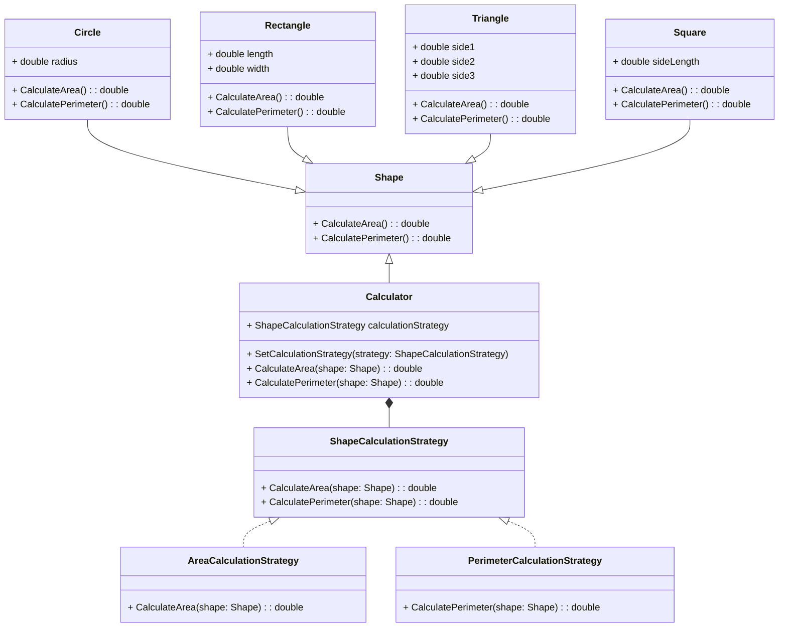

```mermaid
classDiagram
    class ShapeCalculationStrategy {
        + CalculateArea(shape: Shape): double
        + CalculatePerimeter(shape: Shape): double
    }

    class AreaCalculationStrategy {
        + CalculateArea(shape: Shape): double
    }

    class PerimeterCalculationStrategy {
        + CalculatePerimeter(shape: Shape): double
    }

    class Shape {
        + CalculateArea(): double
        + CalculatePerimeter(): double
    }

    class Circle {
        + double radius
        + CalculateArea(): double
        + CalculatePerimeter(): double
    }

    class Rectangle {
        + double length
        + double width
        + CalculateArea(): double
        + CalculatePerimeter(): double
    }

    class Triangle {
        + double side1
        + double side2
        + double side3
        + CalculateArea(): double
        + CalculatePerimeter(): double
    }

    class Square {
        + double sideLength
        + CalculateArea(): double
        + CalculatePerimeter(): double
    }

    class Calculator {
        + ShapeCalculationStrategy calculationStrategy
        + SetCalculationStrategy(strategy: ShapeCalculationStrategy)
        + CalculateArea(shape: Shape): double
        + CalculatePerimeter(shape: Shape): double
    }

    Circle --|> Shape
    Rectangle --|> Shape
    Triangle --|> Shape
    Square --|> Shape
    Shape <|-- Calculator
    ShapeCalculationStrategy <|.. AreaCalculationStrategy
    ShapeCalculationStrategy <|.. PerimeterCalculationStrategy
    Calculator *-- ShapeCalculationStrategy

```
